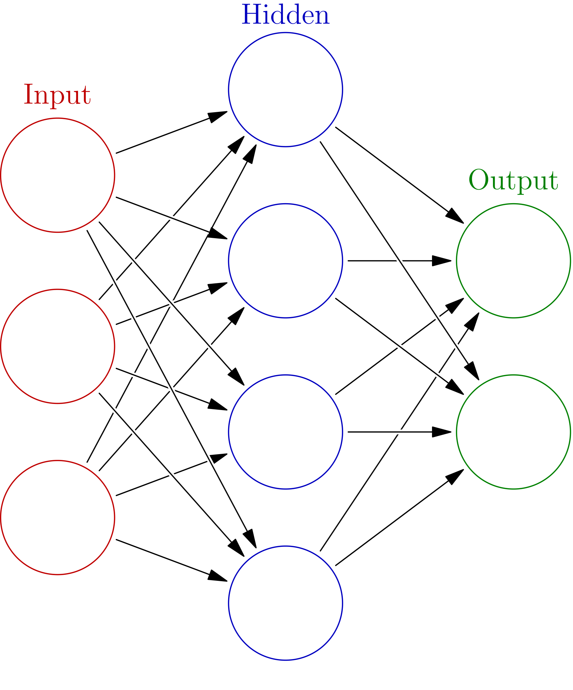

```{r setup, include=FALSE}
knitr::opts_chunk$set(
  echo = TRUE,
  fig.align = 'center',
  fig.width = 8,
  out.width = "100%")
```

## Introduction

This is the first post in a series on generating text with recurrent neural networks (RNNs).
We will be using the [R interface to Keras](https://keras.rstudio.com/) for training and making predictions with our models.
All of the code to reproduce this analysis has been echoed and is also available on [my Github](https://github.com/jamesotto852/Text_Generation).

***

First, we load several `R` packages necessary for our analysis:

```{r setup_visible, message = FALSE}
library("tidyverse"); theme_set(theme_bw()); theme_update(panel.grid.minor = element_blank())
library("here")

library("tensorflow")
library("keras")
```

***

### A (Brief) Introduction to Neural Networks

Neural networks are powerful models which are capable of expressing highly non-linear relationships.
This is accomplished via the composition of linear functions and non-linear activation functions.
Typically, observations of $p$ variables are taken as input, mapped through "hidden layers",
and ultimately transformed to predict some response.
This is illustrated in the graphic below, reproduced from [Wikipedia](https://en.wikipedia.org/wiki/Artificial_neural_network):

<center>

{width=33%}

</center>

The details of how neural networks work is beyond the scope of this post, but there are many high quality resources available online.
[Deep Learning](https://www.deeplearningbook.org/) by Ian Goodfellow, Yoshua Bengio, and Aaron Courville is a great place to start.

### A (Briefer) Introduction to Recurrent Neural Networks

Recurrent neural networks (RNNs) are a special case of neural networks where information is 
preserved between predictions.
RNNs make one step ahead predictions based on sequential inputs (analogous to time series data).
Information from previous inputs is preserved in the network's "memory" which is maintained via the transfer of information between hidden layers along sequential predictions.
<!-- RNNs can be used to predict arbitrarily long continuations of sequences by treating predictions as new data. -->

Again, this post will not go into the details of RNNs. But, the text referenced above contains a thorough treatment of the subject.

***

### Our Goal

We are going to be considering the use of RNNs in language modeling.
If we treat text as sequences of characters, we can generate new text by making predictions with RNNs.
By feeding in sequences of characters of some fixed length, we can train a network to predict the next character --
essentially teaching it how to type.

It is a common tactic to train RNNs on sequences of length $k$ 
and pad new input with whitespace to be of length $k$ to ensure compatibility with the model.
This allows us to make predictions on "seeds" of arbitrary lengths.
We believe this may have adverse effects on a network's predictions,
padded seeds do not resemble training observations.
We will train several networks, of lengths 1, 5, 10, and 30
and "bootstrap" the prediction process.

For example, if we wanted to make predictions based on the input "seed" `"A"`,
we would use the RNN trained on sequences of length 1 to predict the first four characters: `"A____"`.
We would then switch to the RNN trained on sequences of length 5 to predict the following 5 characters,
at which point we would switch to the network trained on sequences of length 10.
Once the sequence reaches a length of 30, we can switch to the final network trained on inputs of length 30.
This procedure can generate predictions from input seeds of arbitrary lengths without padding!

While we are considering the specific application of character generation,
the idea of making predictions using several models trained on sequences of increasing
lengths generalizes to other applications of RNNs as well

***

## Training a Network

We have formatted the data so that it is ready to be fed into the RNNs we are going to train.
For details on the data wrangling process, see the [Appendix](https://jamesotto852.github.io/text-generation-0/).
Currently, we have data frames containing all sequences of lengths 1, 5, 10, and 30 for each corpus.
Before fitting models for all corpuses and sequences, we'll walk through the process of training a RNN on sequences of length 5 from Merry Shelley's Frankenstein.

First, we have to do a little processing as keras expects data in the form of matrices:

```{r data, message = FALSE}
df <- read_csv(here("Data/Training_Data/Merry Shelley/df_seq_5.csv")) 

X_mat <- df |>
  select(starts_with("X")) |>
  as.matrix()

Y_mat <- df |>
  select(Y) |>
  as.matrix()

# keras starts enumerating at 0
X_mat <- X_mat - 1
Y_mat <- Y_mat - 1
```

Now, we define the RNN.
Notice, we have an embedding layer before the rnn layer.
The embedding layer "condenses" the high dimensional binary input space representing all of the characters into
a lower dimensional continuous space with relevant distances which are learned from the data.
After being mapped into this space, the data is ready for the the recurrent layer.

```{r define_network, message = FALSE}
n_target_nodes <- length(unique(df$Y)) 

model <- keras_model_sequential() |>
  layer_embedding(input_dim = n_target_nodes, output_dim = 16) |>
  layer_simple_rnn(units = 1000, activation = "relu") |>
  layer_dense(units = n_target_nodes, activation = "softmax")

model |> compile(loss = "sparse_categorical_crossentropy", optimizer = "adam", metrics = "accuracy")
```

```{r summary_network}
summary(model)
```

Next, we train the network.
Note, we use a validation split of .1 to compare training and validation loss and accuracy across epochs.

```{r training_nework_show, eval = FALSE}
model |> fit(
    X_mat, Y_mat,
    batch_size = 1000, 
    epochs = 40, 
    validation_split = 0.1)
```

```{r training_network_hide, eval = FALSE, include = FALSE}
history <- model |> fit(
    X_mat, Y_mat,
    batch_size = 1000, 
    epochs = 40, 
    validation_split = 0.1)

write_rds(history, here("Blog Posts/1 - Training/model_examples/history.rds"))
save_model_hdf5(model, here("Blog Posts/1 - Training/model_examples/model_5_blog_ex.h5"))
```

```{r loading_network, include = FALSE}
history <- read_rds(here("Blog Posts/1 - Training/model_examples/history.rds"))
model <- load_model_hdf5(here("Blog Posts/1 - Training/model_examples/model_5_blog_ex.h5"))
```

```{r history_network, echo = FALSE}
plot(history, smooth = FALSE) + 
  geom_line()
```

Although it appears that the optimal number of epochs to train is near 6, 
we found that training on a larger number (around 40) yielded better generated text.
We are not sure why this is the case, we believe it might be due to the fact that accuracy and cross entropy loss
are poor metrics of success for these models.
It is also possible that mild overfitting is necessary to produce coherent output.


***

Finally, we are able to make predictions from input sequences!
We do so below using the seed `"Frank"`.
Notice, we are sampling from the probability distribution defined by the output layer of the RNN and
not just picking the character with the maximal softmax value.
This prevents the generated text from getting stuck in loops.

```{r eval_network, comment = "", cache = TRUE}
set.seed(1)

# need encoder/decoder
Shelley_data <- read_rds(here("Data/Training_Data/Merry Shelley/data.RDS"))

# Making predictions starting with seed "Frank"
seed <- c("F", "r", "a", "n", "k") |>
  Shelley_data$encoder() |>
  matrix(ncol = 5) 

seed <- seed - 1 # Off-by-one between R and Python

for (i in 1:1000) {
  X <- rev(seed)[1:5]
  X <- rev(X)
  X <- matrix(X, ncol = 5)
  
  probs <- predict(model, X) |>
    as.vector()
  
  choices <- 1:(length(probs)) - 1 # Off-by-one between R and Python
  pred <- sample(x = choices, size = 1, prob = probs) 
  
  seed <- c(seed, pred)
}

seed <- seed + 1 # Off-by-one between R and Python

map_chr(seed, Shelley_data$decoder) |>
  paste(collapse = "") |>
  (\(x) cat("\t", x, sep = ""))()

```

It looks *okay*.
The generated text is not going to pass a Turing test, but it is pretty impressive considering it is being "typed" out 
one character at a time by the RNN.

***

## Training all the Networks

In order to train individual networks for each combination of author and sequences of length 1, 5, 10, and 30
we need to make some concessions -- it is infeasible to optimize hyperparameters for each network.
We train each network for 40 epochs, as we mentioned earlier this number seems to produce the best predictions regardless of the validation accuracy and loss.
<!-- We train each network for 8 epochs. -->
<!-- While this seems inappropriate, we spot checked several author and sequence length combinations -->
<!-- and for each it seemed that the training and validation error diverged after around 8 epochs of training. -->
We also chose to construct each network with the same structure.
This is certainly suboptimal and would be an interesting choice to investigate, the networks with input dimension 1 surely need to have a different number of nodes in the hidden RNN layer than those with input dimension 30.
We also use the default learning rate of .001, batch sizes of 1000, and do not implement any kind of regularization (e.g. dropout).

```{r data_30, include = FALSE, eval = FALSE}
df <- read_csv(here("Data/Training_Data/Jane Austen/df_seq_30.csv")) 

X_mat <- df |>
  select(starts_with("X")) |>
  as.matrix()

Y_mat <- df |>
  select(Y) |>
  as.matrix()

# keras starts index at 0
X_mat <- X_mat - 1
Y_mat <- Y_mat - 1

n_target_nodes <- length(unique(df$Y)) 

model <- keras_model_sequential() |>
  layer_embedding(input_dim = n_target_nodes, output_dim = 16) |>
  # layer_lstm(units = 1000, activation = "tanh") |>
  layer_simple_rnn(units = 1000, activation = "relu") |>
  layer_dense(units = n_target_nodes, activation = "softmax")

model |> compile(loss = "sparse_categorical_crossentropy", optimizer = "adam", metrics = "accuracy")

history <- model |> fit(
    X_mat, Y_mat,
    batch_size = 1000, 
    epochs = 40, 
    validation_split = 0.1)

write_rds(history, here("Blog Posts/1 - Training/model_examples/history_30.rds"))
```

```{r history_network_30, echo = FALSE, eval = FALSE}
history <- read_rds(here("Blog Posts/1 - Training/model_examples/history_30.rds"))

plot(history, smooth = FALSE) + 
  geom_line()
```

We train the networks programmatically, mapping across the data sets.
Notice this is the same code as before, just slightly more general.
Now that all of the networks are trained, we are able to evaluate their predictions.
See [Text Generation 2 - Making Predictions](https://jamesotto852.github.io/text-generation-2/) for our results.

```{r source_create_training_data, echo = FALSE}
source(here("R/fit_model.R"), local = knitr::knit_global())
```
```{r show_create_training_data, code=xfun::read_utf8(here::here("R/fit_model.R"))}
```

```{r creating_training_data, eval = FALSE}
expand_grid(author = list.files(here("Data/Gutenberg/raw")), k = c(1, 5, 10, 30)) |>
  mutate(n_epochs = 40) |>
  pwalk(fit_model)
```


